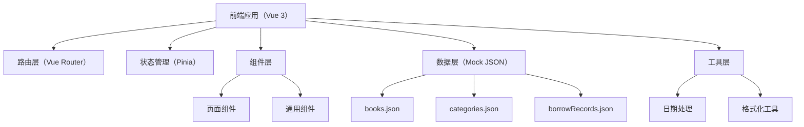
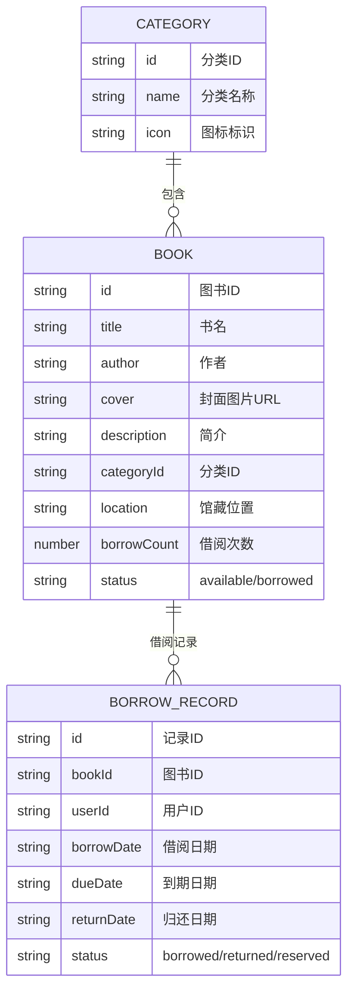

## 1. 架构设计



## 2. 技术描述

- **前端框架**：Vue 3 + TypeScript + Vite
- **路由**：Vue Router 4
- **状态管理**：Pinia
- **样式方案**：Tailwind CSS 3
- **字体**：思源宋体、思源黑体（Google Fonts）
- **数据**：本地 JSON 模拟数据，分模块存储
- **包管理器**：npm

## 3. 路由定义

| 路由 | 页面 | 说明 |
|------|------|------|
| `/` | HomePage | 首页书架，展示在借/可借分区 |
| `/browse` | BrowsePage | 选书页，分类筛选和排序 |
| `/browse/:id` | BookDetailPage | 图书详情页（可选，或弹窗形式） |
| `/my` | MyPage | 我的页面，借阅记录和到期提醒 |

## 4. 数据模型

### 4.1 数据模型定义



### 4.2 类型定义

```typescript
// Book - 图书
interface Book {
  id: string;
  title: string;
  author: string;
  cover: string;
  description: string;
  categoryId: string;
  location: string;
  borrowCount: number;
  status: 'available' | 'borrowed';
}

// Category - 分类
interface Category {
  id: string;
  name: string;
  icon: string;
}

// BorrowRecord - 借阅记录
interface BorrowRecord {
  id: string;
  bookId: string;
  userId: string;
  borrowDate: string;
  dueDate: string;
  returnDate?: string;
  status: 'borrowed' | 'returned' | 'reserved';
}
```

## 5. 项目目录结构

```
src/
├── assets/           # 静态资源（图片、字体）
├── components/       # 通用组件
│   ├── BookCard.vue
│   ├── NavBar.vue
│   └── BookDetailModal.vue
├── composables/      # 组合式函数
│   └── useBorrow.ts
├── data/             # 模拟数据
│   ├── books.json
│   ├── categories.json
│   └── borrowRecords.json
├── pages/            # 页面组件
│   ├── HomePage.vue
│   ├── BrowsePage.vue
│   └── MyPage.vue
├── router/           # 路由配置
│   └── index.ts
├── stores/           # Pinia 状态管理
│   └── borrowStore.ts
├── types/            # TypeScript 类型定义
│   └── index.ts
├── utils/            # 工具函数
│   └── date.ts
├── App.vue
├── main.ts
└── style.css         # 全局样式和 Tailwind 配置
```
